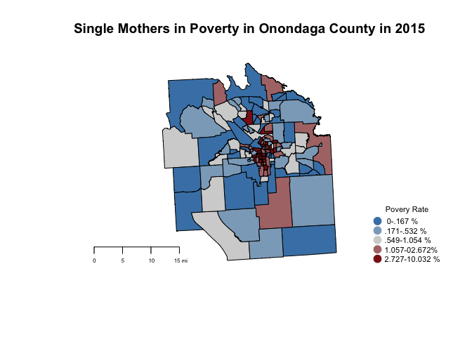
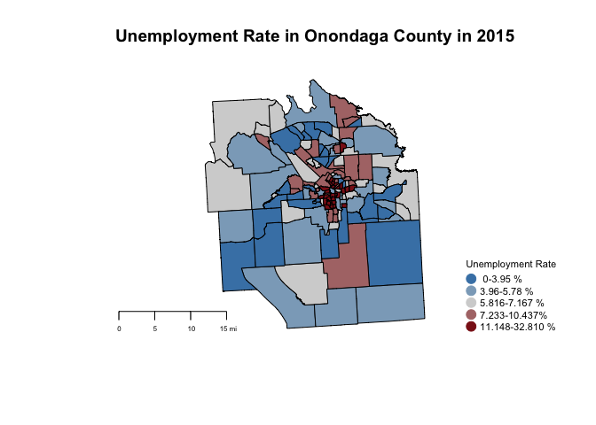

Lab3
================
Jon Beeler
February 9, 2017

Map 1

``` r
dir.create( "shapefiles" )

setwd( "/Users/beelerenator/Documents/Graduate School/MPA Syracuse/DDMII/Lab3 - Shapefiles")

#transfer in shapefiles for onondoga
#download.file("ftp://ftp2.census.gov/geo/tiger/TIGER2010/TRACT/2010/tl_2010_36067_tract10.zip", "onondaga census tracts.zip" )

#unzip( "onondaga census tracts.zip" )

#file.remove( "onondaga census tracts.zip" )

onondoga <- readShapePoly( fn="tl_2010_36067_tract10", proj4string=CRS("+proj=longlat +datum=WGS84") )
dat.onondoga <- as.data.frame( onondoga )

censuskey <- "432376ffd1a15d644d4cd2aa0d664a3f3b885726"
# download acs5 2015 for median fam income, single mother, population, uninsured, insured
acs5_2015 <- getCensus(name="acs5", vintage=2015, key=censuskey, 
    vars=c("B19013_001E","B17010_017E", "B01001_001E","B23025_005E", "B23025_002E" ), region="tract:*", regionin = "state: 36 + county: 067")

#rename variables
acs5_2015 <- plyr::rename(acs5_2015, c("B19013_001E"="MedianFamIncome", "B17010_017E"="Single_Mom_Pov", "B01001_001E"="total.population","B23025_005E"="unemployed", "B23025_002E"="total.labor.force" ))

acs5_2015 <- mutate(acs5_2015, Single_Mom_Pov.Percent = Single_Mom_Pov/total.population)
#acs5_2015 <- mutate(acs5_2015, UninsuredInsured.total = uninsured+insured)
#acs5_2015 <- mutate(acs5_2015, Uninsured.Percent = uninsured/UninsuredInsured.total)
acs5_2015 <- mutate(acs5_2015, Unemployed.Percent = unemployed/total.labor.force) 

#assign a color to each level of unemployment, red = high, gray = medium, blue = low

color.function <- colorRampPalette( c("firebrick4","light gray","steel blue" ) )

col.ramp <- color.function( 5 ) # number of groups you desire

color.vector <- cut( rank(acs5_2015$MedianFamIncome), breaks=5, labels=col.ramp )

color.vector <- as.character( color.vector )

this.order <- match( dat.onondoga$TRACTCE10, acs5_2015$tract )

color.vec.ordered <- color.vector[ this.order ]

plot(onondoga, col=color.vec.ordered, main="Median Family Income in Onondaga County")
map.scale( metric=F, ratio=F, relwidth = 0.15, cex=0.5 )
legend.text=c(" $8,943-$30,560"," $31,353-$46,458"," $48,611-$62,708","$63,013-$75,357","$75,702-$125,724")
legend( "bottomright", bg="white",
        pch=19, pt.cex=1.5, cex=0.7,
        legend=legend.text, 
        col=col.ramp, 
        box.col="white",
        title="Median Family Income" 
       )
```


``` r
#sorted values for median family income 
median.fam.income.arranged <- arrange(acs5_2015, (MedianFamIncome))

#slice(median.fam.income.arranged, 1) #8943
#slice(median.fam.income.arranged, 28) #30560
#slice(median.fam.income.arranged, 29) #31353
#slice(median.fam.income.arranged, 56) #46458
#slice(median.fam.income.arranged, 57) #48611
#slice(median.fam.income.arranged, 84) #62708
#slice(median.fam.income.arranged, 85) #63013
#slice(median.fam.income.arranged, 112) #75357
#slice(median.fam.income.arranged, 113) #75702
#slice(median.fam.income.arranged, 139) #125724
#1-28, 29-56, 57-84, 85-112, 113-140
```

Map 2

``` r
color.function2 <- colorRampPalette( c("steel blue","light gray","firebrick4") )

col.ramp2 <- color.function2( 5 ) # number of groups you desire

color.vector2 <- cut( rank(acs5_2015$Single_Mom_Pov.Percent), breaks=5, labels=col.ramp2 )

color.vector2 <- as.character( color.vector2)

this.order2 <- match( dat.onondoga$TRACTCE10, acs5_2015$tract )

color.vec.ordered2 <- color.vector2[ this.order2 ]

plot(onondoga, col=color.vec.ordered2, main="Single Mothers in Poverty in Onondaga County in 2015")
map.scale( metric=F, ratio=F, relwidth = 0.15, cex=0.5 )
legend.text=c(" 0-.167 %",".171-.532 %",".549-1.054 %","1.057-02.672%","2.727-10.032 %")
legend( "bottomright", bg="white",
        pch=19, pt.cex=1.5, cex=0.7,
        legend=legend.text, 
        col=col.ramp2, 
        box.col="white",
        title="Povery Rate" 
       )
```



``` r
single.mom.pov.percent.arranged <- arrange(acs5_2015, (Single_Mom_Pov.Percent))

#slice(single.mom.pov.percent.arranged, 1) #0
#slice(single.mom.pov.percent.arranged , 28) #0.00167294
#slice(single.mom.pov.percent.arranged, 29) #0.001713429        
#slice(single.mom.pov.percent.arranged, 56) #0.005323573    
#slice(single.mom.pov.percent.arranged, 57) #0.005486467
#slice(single.mom.pov.percent.arranged, 84) #0.01054313
#slice(single.mom.pov.percent.arranged, 85) #0.01056557
#slice(single.mom.pov.percent.arranged, 112) #0.02672209
#slice(single.mom.pov.percent.arranged, 113) #0.02727
#slice(single.mom.pov.percent.arranged, 140) #0.1003177 

#1-28, 29-56, 57-84, 85-112, 113-140
```

Map 3

``` r
color.function3 <- colorRampPalette( c("steel blue","light gray","firebrick4") )

col.ramp3 <- color.function3( 5 ) # number of groups you desire

color.vector3 <- cut( rank(acs5_2015$Unemployed.Percent), breaks=5, labels=col.ramp3 )

color.vector3 <- as.character( color.vector3)

this.order3 <- match( dat.onondoga$TRACTCE10, acs5_2015$tract )

color.vec.ordered3 <- color.vector3[ this.order3 ]

plot(onondoga, col=color.vec.ordered3, main="Unemployment Rate in Onondaga County in 2015")
map.scale( metric=F, ratio=F, relwidth = 0.15, cex=0.5 )
legend.text=c(" 0-3.95 %","3.96-5.78 %","5.816-7.167 %","7.233-10.437%","11.148-32.810 %")
legend( "bottomright", bg="white",
        pch=19, pt.cex=1.5, cex=0.7,
        legend=legend.text, 
        col=col.ramp2, 
        box.col="white",
        title="Unemployment Rate" 
       )
```



``` r
unemployed.percent.arranged <- arrange(acs5_2015, (Unemployed.Percent))

#slice(unemployed.percent.arranged, 1) #0
#slice(unemployed.percent.arranged , 28) #0.03950722
#slice(unemployed.percent.arranged, 29) #0.03964528 
#slice(unemployed.percent.arranged, 56) #0.05780933
#slice(unemployed.percent.arranged, 57) #0.05815832
#slice(unemployed.percent.arranged, 84) #0.07166717
#slice(unemployed.percent.arranged, 85) #0.07233443
#slice(unemployed.percent.arranged, 112) #0.1043724
#slice(unemployed.percent.arranged, 113) #0.1114827
#slice(unemployed.percent.arranged, 140) #0.3281027

#1-28, 29-56, 57-84, 85-112, 113-140
```
