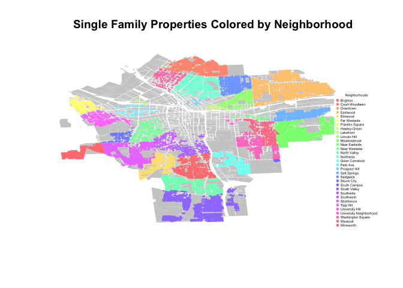
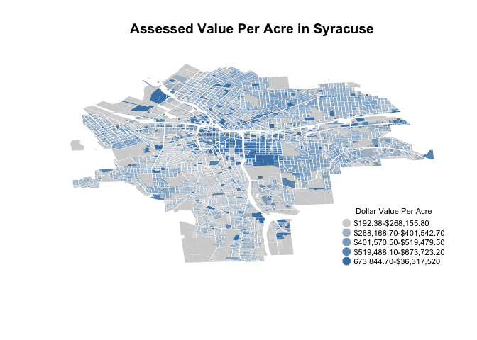
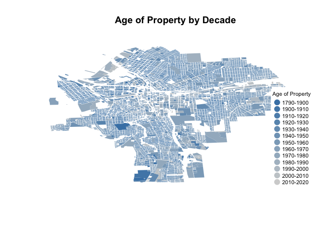

Lab4
================
Jon Beeler
February 9, 2017

``` r
setwd("/Users/beelerenator/Documents/Graduate School/MPA Syracuse/DDMII/Lab3 - Shapefiles")
#unzip( "01-05-2015.zip" )

#file.remove( "01-05-2015.zip" )
library(maptools)
library(sp)
library(devtools)
library(censusapi)
library(dplyr)
library(pander)
library(maps)
library(RColorBrewer)
```

Question 1: How many single family homes are in each neighborhood?

``` r
setwd("/Users/beelerenator/Documents/Graduate School/MPA Syracuse/DDMII/Lab3 - Shapefiles")

syr <- readShapePoly( fn="01-05-2015", proj4string=CRS("+proj=longlat +datum=WGS84") )

#plot( syr,  border="gray80" )

#head( as.data.frame( syr ) )

dat <- as.data.frame( syr )

#names( dat )

#nrow( dat )

#table( dat$LandUse)

#devtools::install_github("hrecht/censusapi")

#censuskey <- "432376ffd1a15d644d4cd2aa0d664a3f3b885726"


#subset to Nhood and LandUse and then filter for Single Family Homes
subset.nhood.landuse <- select(dat, Nhood, LandUse)
subset.singlefam <- filter(subset.nhood.landuse, LandUse=="Single Family" )
#count(subset.nhood.landuse, Nhood, LandUse=="Single Family")
singlefam.homes.each.hood <- count(subset.singlefam, Nhood)
#table(subset.singlefam$Nhood)  - same way as above
pander(singlefam.homes.each.hood)
```

<table style="width:39%;">
<colgroup>
<col width="33%" />
<col width="5%" />
</colgroup>
<thead>
<tr class="header">
<th align="center">Nhood</th>
<th align="center">n</th>
</tr>
</thead>
<tbody>
<tr class="odd">
<td align="center">Brighton</td>
<td align="center">1398</td>
</tr>
<tr class="even">
<td align="center">Court-Woodlawn</td>
<td align="center">1859</td>
</tr>
<tr class="odd">
<td align="center">Downtown</td>
<td align="center">1</td>
</tr>
<tr class="even">
<td align="center">Eastwood</td>
<td align="center">3605</td>
</tr>
<tr class="odd">
<td align="center">Elmwood</td>
<td align="center">909</td>
</tr>
<tr class="even">
<td align="center">Far Westside</td>
<td align="center">471</td>
</tr>
<tr class="odd">
<td align="center">Hawley-Green</td>
<td align="center">52</td>
</tr>
<tr class="even">
<td align="center">Lakefront</td>
<td align="center">24</td>
</tr>
<tr class="odd">
<td align="center">Lincoln Hill</td>
<td align="center">580</td>
</tr>
<tr class="even">
<td align="center">Meadowbrook</td>
<td align="center">1721</td>
</tr>
<tr class="odd">
<td align="center">Near Eastside</td>
<td align="center">93</td>
</tr>
<tr class="even">
<td align="center">Near Westside</td>
<td align="center">521</td>
</tr>
<tr class="odd">
<td align="center">North Valley</td>
<td align="center">1194</td>
</tr>
<tr class="even">
<td align="center">Northside</td>
<td align="center">1508</td>
</tr>
<tr class="odd">
<td align="center">Outer Comstock</td>
<td align="center">697</td>
</tr>
<tr class="even">
<td align="center">Park Ave.</td>
<td align="center">167</td>
</tr>
<tr class="odd">
<td align="center">Prospect Hill</td>
<td align="center">29</td>
</tr>
<tr class="even">
<td align="center">Salt Springs</td>
<td align="center">1029</td>
</tr>
<tr class="odd">
<td align="center">Sedgwick</td>
<td align="center">892</td>
</tr>
<tr class="even">
<td align="center">Skunk City</td>
<td align="center">345</td>
</tr>
<tr class="odd">
<td align="center">South Campus</td>
<td align="center">25</td>
</tr>
<tr class="even">
<td align="center">South Valley</td>
<td align="center">1605</td>
</tr>
<tr class="odd">
<td align="center">Southside</td>
<td align="center">481</td>
</tr>
<tr class="even">
<td align="center">Southwest</td>
<td align="center">419</td>
</tr>
<tr class="odd">
<td align="center">Strathmore</td>
<td align="center">1475</td>
</tr>
<tr class="even">
<td align="center">Tipp Hill</td>
<td align="center">785</td>
</tr>
<tr class="odd">
<td align="center">University Hill</td>
<td align="center">17</td>
</tr>
<tr class="even">
<td align="center">University Neighborhood</td>
<td align="center">803</td>
</tr>
<tr class="odd">
<td align="center">Washington Square</td>
<td align="center">425</td>
</tr>
<tr class="even">
<td align="center">Westcott</td>
<td align="center">851</td>
</tr>
<tr class="odd">
<td align="center">Winkworth</td>
<td align="center">411</td>
</tr>
</tbody>
</table>

``` r
#SingleFam <- rep( NA, nrow(dat) )
#SingleFam[ dat$LandUse == "Single Family"  ] <- SingleFam
#plot( syr,  border="gray80", col=SingleFam, main="Sedgwick" )


#dat2 <- filter(dat, LandUse== "Single Family")
#sedgwick <- rep( NA, nrow(dat2) )

#sedgwick[ dat2$Nhood == "Sedgwick"  ] <- "red" 

#plot( syr,  border="gray80", col=sedgwick, main="Sedgwick" )


#res <- ifelse( subset.singlefam$Nhood , "red", "blue", "green", "gray80" )

#plot( syr, border=NA, col=res, main="Residential Properties" )
#best one yet
 #plot( syr, border="gray80", col= subset.singlefam$Nhood)
#names(syr)


these.SingleFamily <- syr$LandUse == "Single Family"

singlefamily <- syr[ these.SingleFamily , ]  # error bc of NAs

these.SingleFamily[ is.na(these.SingleFamily) ] <- F

singlefamily <- syr[ these.SingleFamily , ]
#plot( syr,  border="gray80", main="Single Family Properties Colored by Neighborhood")

rainbowcols <- rainbow(31,
 s = 0.5)

#darkcols <- brewer.pal(31, "Blues")

palette(rainbowcols)

not.single.fam <- syr[syr$LandUse != "Single Family", ]
plot(not.single.fam, col="gray80", border=F, main="Single Family Properties Colored by Neighborhood")
plot( singlefamily, border=singlefamily$Nhood, col=singlefamily$Nhood, add=T)
legend( "bottomright", bg="white",
        pch=19, pt.cex=.5, cex=0.35,
        legend=levels(singlefamily$Nhood), 
        col=rainbowcols, 
        box.col="white",
        title="Neighborhoods") 
```



``` r
#residential <- subset.singlefam$LandUse == "Single Family" 
#table(residential)
#res <- ifelse( residential, "red", "gray80" )

#plot( syr, border=NA, col=res, main="Residential Properties" )


#public.housing <- ifelse( syr$LandUse == "Single Family" & syr$Nhood == "South Valley", "red", NA )
#westcott <- ifelse( syr$LandUse == "Single Family" & syr$Nhood == "Westcott", "blue", NA )
#northside <- ifelse( syr$LandUse == "Single Family" & syr$Nhood == "Northside", "green", NA )

#table( public.housing )

#plot( syr, border="gray80", col=public.housing)
#plot( syr, border="gray80", col=westcott, add=T )
#plot( syr, border="gray80", col=northside, add=T )
```

Question 2: Where does land in Syracuse have the highest value?

``` r
Nhood.LandUse.AV <- select(dat, Nhood, LandUse, AssessedVa)
s.fam.subset <- filter(Nhood.LandUse.AV, LandUse == "Single Family" )

Above200kNhood.LandUse.AV <- filter(s.fam.subset, AssessedVa > 200000 )
Above200kNhood.LandUse.AV <- select(Above200kNhood.LandUse.AV, Nhood, AssessedVa)
Below200kNhood.LandUse.AV <- filter(s.fam.subset, AssessedVa < 200000 )
count.below.200k <- count(Below200kNhood.LandUse.AV, Nhood)
count.above.200k <- count(Above200kNhood.LandUse.AV, Nhood)

dat6 <- as.data.frame(table(Above200kNhood.LandUse.AV$Nhood))
count.total <- as.data.frame(table(s.fam.subset$Nhood))

count.total <- plyr::rename(count.total, c("Freq"="Total" ))
count.total <- select(count.total, Total)
total.and.above200k <- cbind(dat6, count.total)
dat.with.percent.above200k <- mutate(total.and.above200k, percentabove200k = Freq / Total )

dat.with.percent.above200k <- plyr::rename(dat.with.percent.above200k, c("Var1"="Neighborhood", "Freq"="Above200k"))
pander(dat.with.percent.above200k)
```

<table style="width:86%;">
<colgroup>
<col width="33%" />
<col width="16%" />
<col width="11%" />
<col width="25%" />
</colgroup>
<thead>
<tr class="header">
<th align="center">Neighborhood</th>
<th align="center">Above200k</th>
<th align="center">Total</th>
<th align="center">percentabove200k</th>
</tr>
</thead>
<tbody>
<tr class="odd">
<td align="center">Brighton</td>
<td align="center">0</td>
<td align="center">1398</td>
<td align="center">0</td>
</tr>
<tr class="even">
<td align="center">Court-Woodlawn</td>
<td align="center">0</td>
<td align="center">1859</td>
<td align="center">0</td>
</tr>
<tr class="odd">
<td align="center">Downtown</td>
<td align="center">0</td>
<td align="center">1</td>
<td align="center">0</td>
</tr>
<tr class="even">
<td align="center">Eastwood</td>
<td align="center">1</td>
<td align="center">3605</td>
<td align="center">0.0002774</td>
</tr>
<tr class="odd">
<td align="center">Elmwood</td>
<td align="center">0</td>
<td align="center">909</td>
<td align="center">0</td>
</tr>
<tr class="even">
<td align="center">Far Westside</td>
<td align="center">0</td>
<td align="center">471</td>
<td align="center">0</td>
</tr>
<tr class="odd">
<td align="center">Franklin Square</td>
<td align="center">0</td>
<td align="center">0</td>
<td align="center">NA</td>
</tr>
<tr class="even">
<td align="center">Hawley-Green</td>
<td align="center">0</td>
<td align="center">52</td>
<td align="center">0</td>
</tr>
<tr class="odd">
<td align="center">Lakefront</td>
<td align="center">0</td>
<td align="center">24</td>
<td align="center">0</td>
</tr>
<tr class="even">
<td align="center">Lincoln Hill</td>
<td align="center">7</td>
<td align="center">580</td>
<td align="center">0.01207</td>
</tr>
<tr class="odd">
<td align="center">Meadowbrook</td>
<td align="center">60</td>
<td align="center">1721</td>
<td align="center">0.03486</td>
</tr>
<tr class="even">
<td align="center">Near Eastside</td>
<td align="center">0</td>
<td align="center">93</td>
<td align="center">0</td>
</tr>
<tr class="odd">
<td align="center">Near Westside</td>
<td align="center">0</td>
<td align="center">521</td>
<td align="center">0</td>
</tr>
<tr class="even">
<td align="center">North Valley</td>
<td align="center">0</td>
<td align="center">1194</td>
<td align="center">0</td>
</tr>
<tr class="odd">
<td align="center">Northside</td>
<td align="center">2</td>
<td align="center">1508</td>
<td align="center">0.001326</td>
</tr>
<tr class="even">
<td align="center">Outer Comstock</td>
<td align="center">3</td>
<td align="center">697</td>
<td align="center">0.004304</td>
</tr>
<tr class="odd">
<td align="center">Park Ave.</td>
<td align="center">0</td>
<td align="center">167</td>
<td align="center">0</td>
</tr>
<tr class="even">
<td align="center">Prospect Hill</td>
<td align="center">0</td>
<td align="center">29</td>
<td align="center">0</td>
</tr>
<tr class="odd">
<td align="center">Salt Springs</td>
<td align="center">0</td>
<td align="center">1029</td>
<td align="center">0</td>
</tr>
<tr class="even">
<td align="center">Sedgwick</td>
<td align="center">130</td>
<td align="center">892</td>
<td align="center">0.1457</td>
</tr>
<tr class="odd">
<td align="center">Skunk City</td>
<td align="center">0</td>
<td align="center">345</td>
<td align="center">0</td>
</tr>
<tr class="even">
<td align="center">South Campus</td>
<td align="center">0</td>
<td align="center">25</td>
<td align="center">0</td>
</tr>
<tr class="odd">
<td align="center">South Valley</td>
<td align="center">5</td>
<td align="center">1605</td>
<td align="center">0.003115</td>
</tr>
<tr class="even">
<td align="center">Southside</td>
<td align="center">0</td>
<td align="center">481</td>
<td align="center">0</td>
</tr>
<tr class="odd">
<td align="center">Southwest</td>
<td align="center">0</td>
<td align="center">419</td>
<td align="center">0</td>
</tr>
<tr class="even">
<td align="center">Strathmore</td>
<td align="center">16</td>
<td align="center">1475</td>
<td align="center">0.01085</td>
</tr>
<tr class="odd">
<td align="center">Tipp Hill</td>
<td align="center">0</td>
<td align="center">785</td>
<td align="center">0</td>
</tr>
<tr class="even">
<td align="center">University Hill</td>
<td align="center">1</td>
<td align="center">17</td>
<td align="center">0.05882</td>
</tr>
<tr class="odd">
<td align="center">University Neighborhood</td>
<td align="center">17</td>
<td align="center">803</td>
<td align="center">0.02117</td>
</tr>
<tr class="even">
<td align="center">Washington Square</td>
<td align="center">0</td>
<td align="center">425</td>
<td align="center">0</td>
</tr>
<tr class="odd">
<td align="center">Westcott</td>
<td align="center">0</td>
<td align="center">851</td>
<td align="center">0</td>
</tr>
<tr class="even">
<td align="center">Winkworth</td>
<td align="center">11</td>
<td align="center">411</td>
<td align="center">0.02676</td>
</tr>
</tbody>
</table>

Plot the value/acre of all parcels in Syracuse

``` r
AssessedVa.Acre <- select(dat, AssessedVa, Acres)
AssessedVa.Acre <- mutate(AssessedVa.Acre, ValuePerAcre = AssessedVa/Acres )

nrow(AssessedVa.Acre)
```

    ## [1] 41502

``` r
color.function <- colorRampPalette( c("light gray","steel blue" ))

col.ramp <- color.function( 5 ) # number of groups you desire

color.vector <- cut( rank(AssessedVa.Acre$ValuePerAcre), breaks=5, labels=col.ramp )

color.vector <- as.character( color.vector )

plot(syr, col=color.vector, border=F, main="Assessed Value Per Acre in Syracuse")
#map.scale( metric=F, ratio=F, relwidth = 0.15, cex=0.5 )

legend.text <- c("$192.38-$268,155.80","$268,168.70-$401,542.70", "$401,570.50-$519,479.50", "$519,488.10-$673,723.20", "673,844.70-$36,317,520")
legend( "bottomright", bg="white",
        pch=19, pt.cex=1.5, cex=0.7,
        legend=legend.text, 
        col=col.ramp, 
        box.col="white",
        title="Dollar Value Per Acre") 
```



``` r
#1-8300, 8301-16,600,  16,601-24,900 , 24,901-33,200, 33,201-41500
assessed.value.arranged <- arrange(AssessedVa.Acre, (ValuePerAcre))

#assessed.value.arranged[1, 3] #192.3828
#assessed.value.arranged[8300, 3] #268155.8
#assessed.value.arranged[8301, 3] # 268168.7
#assessed.value.arranged[16600, 3]# 401542.7
#assessed.value.arranged[16601, 3] #401570.5
#assessed.value.arranged[24900, 3] #519479.5
#assessed.value.arranged[24901, 3] #519488.1
#assessed.value.arranged[33200, 3] #673723.2
#assessed.value.arranged[33201, 3] #673844.7
#assessed.value.arranged[41500, 3] #36317520
```

Questions 3: What is the age of single family homes in each neighborhood?

``` r
Nhood.YearBuilt <- select(dat, Nhood, LandUse, YearBuilt)
Yearbuilt.subset <- filter(Nhood.YearBuilt, LandUse == "Single Family" )

Yearbuilt.subset$YearBuilt <- as.numeric(as.character((Yearbuilt.subset$YearBuilt)))

Yearbuilt.subset <- mutate(Yearbuilt.subset, Age = 2017 - YearBuilt)
Yearbuilt.subset <- select(Yearbuilt.subset, Nhood, Age)

Groupedby_YearBuilt <- group_by(Yearbuilt.subset, Nhood)

PercentileTable <- summarise(Groupedby_YearBuilt, Tenth = quantile(Age, probs=0.10, na.rm=T), TwentyFifth = quantile(Age, probs=0.25, na.rm=T), Fiftieth = quantile(Age, probs=0.50, na.rm=T), SeventyFifth = quantile(Age, probs=0.75, na.rm=T), Ninetieth = quantile(Age, probs=0.90, na.rm=T))
pander(PercentileTable)
```

<table>
<colgroup>
<col width="28%" />
<col width="9%" />
<col width="16%" />
<col width="13%" />
<col width="18%" />
<col width="13%" />
</colgroup>
<thead>
<tr class="header">
<th align="center">Nhood</th>
<th align="center">Tenth</th>
<th align="center">TwentyFifth</th>
<th align="center">Fiftieth</th>
<th align="center">SeventyFifth</th>
<th align="center">Ninetieth</th>
</tr>
</thead>
<tbody>
<tr class="odd">
<td align="center">Brighton</td>
<td align="center">62.0</td>
<td align="center">87.00</td>
<td align="center">97</td>
<td align="center">107</td>
<td align="center">117.0</td>
</tr>
<tr class="even">
<td align="center">Court-Woodlawn</td>
<td align="center">64.0</td>
<td align="center">74.00</td>
<td align="center">88</td>
<td align="center">97</td>
<td align="center">117.0</td>
</tr>
<tr class="odd">
<td align="center">Downtown</td>
<td align="center">89.0</td>
<td align="center">89.00</td>
<td align="center">89</td>
<td align="center">89</td>
<td align="center">89.0</td>
</tr>
<tr class="even">
<td align="center">Eastwood</td>
<td align="center">62.0</td>
<td align="center">74.00</td>
<td align="center">87</td>
<td align="center">97</td>
<td align="center">102.0</td>
</tr>
<tr class="odd">
<td align="center">Elmwood</td>
<td align="center">61.3</td>
<td align="center">82.00</td>
<td align="center">89</td>
<td align="center">97</td>
<td align="center">117.0</td>
</tr>
<tr class="even">
<td align="center">Far Westside</td>
<td align="center">87.0</td>
<td align="center">97.00</td>
<td align="center">107</td>
<td align="center">117</td>
<td align="center">127.0</td>
</tr>
<tr class="odd">
<td align="center">Hawley-Green</td>
<td align="center">88.0</td>
<td align="center">107.00</td>
<td align="center">117</td>
<td align="center">127</td>
<td align="center">146.1</td>
</tr>
<tr class="even">
<td align="center">Lakefront</td>
<td align="center">88.6</td>
<td align="center">97.00</td>
<td align="center">112</td>
<td align="center">127</td>
<td align="center">137.0</td>
</tr>
<tr class="odd">
<td align="center">Lincoln Hill</td>
<td align="center">32.0</td>
<td align="center">87.00</td>
<td align="center">97</td>
<td align="center">117</td>
<td align="center">127.0</td>
</tr>
<tr class="even">
<td align="center">Meadowbrook</td>
<td align="center">57.0</td>
<td align="center">62.00</td>
<td align="center">67</td>
<td align="center">85</td>
<td align="center">91.0</td>
</tr>
<tr class="odd">
<td align="center">Near Eastside</td>
<td align="center">74.1</td>
<td align="center">82.00</td>
<td align="center">97</td>
<td align="center">112</td>
<td align="center">127.0</td>
</tr>
<tr class="even">
<td align="center">Near Westside</td>
<td align="center">16.5</td>
<td align="center">28.00</td>
<td align="center">97</td>
<td align="center">117</td>
<td align="center">136.4</td>
</tr>
<tr class="odd">
<td align="center">North Valley</td>
<td align="center">57.0</td>
<td align="center">62.00</td>
<td align="center">82</td>
<td align="center">92</td>
<td align="center">105.0</td>
</tr>
<tr class="even">
<td align="center">Northside</td>
<td align="center">87.0</td>
<td align="center">97.00</td>
<td align="center">107</td>
<td align="center">117</td>
<td align="center">127.0</td>
</tr>
<tr class="odd">
<td align="center">Outer Comstock</td>
<td align="center">52.0</td>
<td align="center">58.00</td>
<td align="center">67</td>
<td align="center">76</td>
<td align="center">92.0</td>
</tr>
<tr class="even">
<td align="center">Park Ave.</td>
<td align="center">87.0</td>
<td align="center">97.00</td>
<td align="center">107</td>
<td align="center">117</td>
<td align="center">127.0</td>
</tr>
<tr class="odd">
<td align="center">Prospect Hill</td>
<td align="center">75.0</td>
<td align="center">87.00</td>
<td align="center">97</td>
<td align="center">117</td>
<td align="center">130.0</td>
</tr>
<tr class="even">
<td align="center">Salt Springs</td>
<td align="center">55.0</td>
<td align="center">62.00</td>
<td align="center">77</td>
<td align="center">89</td>
<td align="center">97.0</td>
</tr>
<tr class="odd">
<td align="center">Sedgwick</td>
<td align="center">64.0</td>
<td align="center">73.75</td>
<td align="center">87</td>
<td align="center">95</td>
<td align="center">107.0</td>
</tr>
<tr class="even">
<td align="center">Skunk City</td>
<td align="center">55.7</td>
<td align="center">87.00</td>
<td align="center">97</td>
<td align="center">117</td>
<td align="center">127.0</td>
</tr>
<tr class="odd">
<td align="center">South Campus</td>
<td align="center">30.8</td>
<td align="center">52.00</td>
<td align="center">60</td>
<td align="center">71</td>
<td align="center">89.0</td>
</tr>
<tr class="even">
<td align="center">South Valley</td>
<td align="center">54.0</td>
<td align="center">62.00</td>
<td align="center">67</td>
<td align="center">87</td>
<td align="center">97.0</td>
</tr>
<tr class="odd">
<td align="center">Southside</td>
<td align="center">24.0</td>
<td align="center">87.00</td>
<td align="center">97</td>
<td align="center">116</td>
<td align="center">117.0</td>
</tr>
<tr class="even">
<td align="center">Southwest</td>
<td align="center">16.5</td>
<td align="center">24.00</td>
<td align="center">87</td>
<td align="center">107</td>
<td align="center">117.0</td>
</tr>
<tr class="odd">
<td align="center">Strathmore</td>
<td align="center">61.0</td>
<td align="center">81.00</td>
<td align="center">91</td>
<td align="center">97</td>
<td align="center">109.0</td>
</tr>
<tr class="even">
<td align="center">Tipp Hill</td>
<td align="center">77.9</td>
<td align="center">92.00</td>
<td align="center">107</td>
<td align="center">117</td>
<td align="center">127.0</td>
</tr>
<tr class="odd">
<td align="center">University Hill</td>
<td align="center">73.0</td>
<td align="center">87.00</td>
<td align="center">97</td>
<td align="center">107</td>
<td align="center">114.0</td>
</tr>
<tr class="even">
<td align="center">University Neighborhood</td>
<td align="center">65.0</td>
<td align="center">71.00</td>
<td align="center">89</td>
<td align="center">97</td>
<td align="center">107.0</td>
</tr>
<tr class="odd">
<td align="center">Washington Square</td>
<td align="center">87.0</td>
<td align="center">97.00</td>
<td align="center">117</td>
<td align="center">137</td>
<td align="center">157.0</td>
</tr>
<tr class="even">
<td align="center">Westcott</td>
<td align="center">62.0</td>
<td align="center">82.00</td>
<td align="center">92</td>
<td align="center">100</td>
<td align="center">117.0</td>
</tr>
<tr class="odd">
<td align="center">Winkworth</td>
<td align="center">46.0</td>
<td align="center">57.00</td>
<td align="center">62</td>
<td align="center">69</td>
<td align="center">87.0</td>
</tr>
</tbody>
</table>

Map!

``` r
YearBuilt.Map <- select(dat, YearBuilt)
YearBuilt.Map$YearBuilt <- as.numeric(as.character((
YearBuilt.Map$YearBuilt)))

color.function2 <- colorRampPalette( c("steel blue","light gray" )) 

col.ramp2 <- color.function2( 13 ) # number of groups you desire

color.vector2 <- cut(YearBuilt.Map$YearBuilt, breaks=c(1790, seq(from = 1900, to = 2020, by =10)), labels = col.ramp2 )  

color.vector2 <- as.character( color.vector2 )

plot(syr, col=color.vector2, border=F, main="Age of Property by Decade")
#map.scale( metric=F, ratio=F, relwidth = 0.15, cex=0.5 )
legend.text <- c("1790-1900","1900-1910", "1910-1920", "1920-1930", "1930-1940", "1940-1950", "1950-1960", "1960-1970", "1970-1980", "1980-1990", "1990-2000", "2000-2010", "2010-2020")
legend( "bottomright", bg="white",
        pch=19, pt.cex=1.5, cex=0.7,
        legend=legend.text, 
        col=col.ramp2, 
        box.col="white",
        title="Age of Property") 
```


