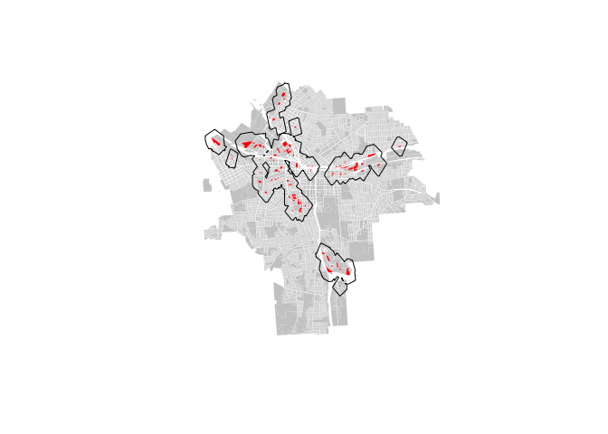

Lab 6
================
Jon Beeler
March 9, 2017

Part 1: 1. Unclipped: Onondaga County census tracts and primary and secondary roads. Plotted together, highlighting interstates

``` r
setwd( "/Users/beelerenator/Documents/Graduate School/MPA Syracuse/DDMII/Lab 6")

#read in shape file of onondaga county
onondoga <- readShapePoly( fn="tl_2010_36067_tract10", proj4string=CRS("+proj=longlat +datum=WGS84") )
roads <- readShapeLines( fn="tl_2015_36_prisecroads", proj4string=CRS("+proj=longlat +datum=WGS84") )

dat.onondoga <- as.data.frame( onondoga )

par( mar=c(0,0,0,0) )
plot( onondoga,  border="gray10" )
```


``` r
### ADD ROADS
#download.file("ftp://ftp2.census.gov/geo/tiger/TIGER2015/PRISECROADS/tl_2015_36_prisecroads.zip", "primary_and_secondary_roads.zip" )
#unzip( "primary_and_secondary_roads.zip" )
#file.remove( "primary_and_secondary_roads.zip" )

dat.roads <- as.data.frame( roads )
table( roads$RTTYP )
```

    ## 
    ##    C    I    M    O    S    U 
    ##  826  268 7009   40 2774  473

``` r
### Extract Interstates

par( mar=c(0,0,0,0) )
plot( onondoga,  border="gray80" )
plot( roads, col="steelblue", lwd=2, add=T )
```


``` r
interstate <- roads[ roads$RTTYP == "I" , ]

par( mar=c(0,0,0,0) )
#y.max <- (43.26848)
#y.min <- (42.77941)
#x.max <- (-75.8487)
#x.min <- (-76.46031)

plot( onondoga,  border="gray80")
plot( roads, col="steelblue", lwd=2, add=T )
plot( interstate, col="red", add=T )
```

 2. and 3. Clipped census tracts with interstate extacted

``` r
b <- bbox(onondoga)

gClip <- function(shp, bb) {
if(class(bb) == "matrix") b_poly <- as(extent(as.vector(t(bb))), "SpatialPolygons") 
else b_poly <- as(extent(bb), "SpatialPolygons")
gIntersection(shp, b_poly, byid = T)
}

onondoga_clipped <- gClip(onondoga, b)
roads_clipped <- gClip(roads, b)
interstate_clipped <- gClip(interstate, b)

plot(onondoga_clipped, border="gray80")
plot(roads_clipped, col="steelblue", lwd=2, add=T )
plot( interstate_clipped, col="red", add=T )
```


1.  Buffer from interstate

``` r
setwd( "/Users/beelerenator/Documents/Graduate School/MPA Syracuse/DDMII/Lab 6")
housing.census.crime <- read.csv("housing.census.crime.dat.csv", stringsAsFactors = F)

plot(onondoga_clipped, border="gray80")
plot( interstate_clipped, col="red", add=T )
points(housing.census.crime$lon, housing.census.crime$lat, pch=19, cex=.2)
buff1 <- gBuffer(interstate_clipped, width=.005, byid=TRUE )
plot(buff1, add=T )
```

 5. New categorical variable indiacting whether houses fall in interstate buffer

``` r
buff.dissolved <- gUnaryUnion( buff1, id = NULL )
lat.long <- dplyr::select(housing.census.crime, lon, lat)

lat.long <- SpatialPoints(lat.long, proj4string=CRS("+proj=longlat +datum=WGS84") )
over.buffer <- over(lat.long, buff.dissolved)

over.buffer <- as.data.frame(over.buffer)
over.buffer[is.na(over.buffer)] <- 0
over.buffer
```

    ##     over.buffer
    ## 1             1
    ## 2             0
    ## 3             0
    ## 4             0
    ## 5             0
    ## 6             0
    ## 7             0
    ## 8             0
    ## 9             0
    ## 10            0
    ## 11            0
    ## 12            0
    ## 13            0
    ## 14            0
    ## 15            0
    ## 16            0
    ## 17            0
    ## 18            0
    ## 19            0
    ## 20            0
    ## 21            0
    ## 22            0
    ## 23            1
    ## 24            1
    ## 25            1
    ## 26            1
    ## 27            1
    ## 28            1
    ## 29            0
    ## 30            0
    ## 31            0
    ## 32            0
    ## 33            0
    ## 34            0
    ## 35            0
    ## 36            0
    ## 37            0
    ## 38            0
    ## 39            0
    ## 40            0
    ## 41            0
    ## 42            0
    ## 43            0
    ## 44            0
    ## 45            1
    ## 46            1
    ## 47            0
    ## 48            0
    ## 49            1
    ## 50            0
    ## 51            0
    ## 52            0
    ## 53            1
    ## 54            0
    ## 55            0
    ## 56            0
    ## 57            1
    ## 58            1
    ## 59            0
    ## 60            1
    ## 61            1
    ## 62            0
    ## 63            0
    ## 64            0
    ## 65            0
    ## 66            0
    ## 67            0
    ## 68            0
    ## 69            0
    ## 70            0
    ## 71            0
    ## 72            0
    ## 73            0
    ## 74            0
    ## 75            0
    ## 76            0
    ## 77            0
    ## 78            0
    ## 79            0
    ## 80            0
    ## 81            0
    ## 82            0
    ## 83            0
    ## 84            0
    ## 85            0
    ## 86            0
    ## 87            0
    ## 88            0
    ## 89            0
    ## 90            0
    ## 91            0
    ## 92            0
    ## 93            0
    ## 94            0
    ## 95            0
    ## 96            0
    ## 97            0
    ## 98            0
    ## 99            0
    ## 100           0
    ## 101           0
    ## 102           0
    ## 103           0
    ## 104           0
    ## 105           0
    ## 106           0
    ## 107           0
    ## 108           0
    ## 109           0
    ## 110           0
    ## 111           0
    ## 112           0
    ## 113           0
    ## 114           0
    ## 115           0
    ## 116           0
    ## 117           0
    ## 118           0
    ## 119           0
    ## 120           0
    ## 121           0
    ## 122           0
    ## 123           0
    ## 124           0
    ## 125           0
    ## 126           0
    ## 127           0
    ## 128           0
    ## 129           0
    ## 130           0
    ## 131           0
    ## 132           0
    ## 133           0
    ## 134           0
    ## 135           0
    ## 136           0
    ## 137           0
    ## 138           0
    ## 139           0
    ## 140           0
    ## 141           0
    ## 142           0
    ## 143           0
    ## 144           0
    ## 145           0
    ## 146           0
    ## 147           0
    ## 148           0

``` r
housing.census.crime.hway.buffer.interstate <- cbind(housing.census.crime, over.buffer)

housing.census.crime.hway.buffer.interstate <- plyr::rename(housing.census.crime.hway.buffer.interstate, c("over.buffer"="Near Interstate"))

head(housing.census.crime.hway.buffer.interstate)
```

    ##   X TRACTCE10 Street.Address.of.House Zip.Code       lon      lat
    ## 1 1       100          139 Pulaski St    13204 -76.17168 43.05846
    ## 2 2       200        1006 Wolf Street    13208 -76.15762 43.07961
    ## 3 3       200        619 2nd N Street    13208 -76.16063 43.07537
    ## 4 4       200            609 2nd N St    13208 -76.16025 43.07522
    ## 5 5       200             709 Wolf St    13208 -76.16095 43.07638
    ## 6 6       300          133 Harford Rd    13208 -76.14412 43.08204
    ##   STATEFP10 COUNTYFP10    GEOID10 NAME10     NAMELSAD10 MTFCC10 FUNCSTAT10
    ## 1        36         67 3.6067e+10      1 Census Tract 1   G5020          S
    ## 2        36         67 3.6067e+10      2 Census Tract 2   G5020          S
    ## 3        36         67 3.6067e+10      2 Census Tract 2   G5020          S
    ## 4        36         67 3.6067e+10      2 Census Tract 2   G5020          S
    ## 5        36         67 3.6067e+10      2 Census Tract 2   G5020          S
    ## 6        36         67 3.6067e+10      3 Census Tract 3   G5020          S
    ##   ALAND10 AWATER10 INTPTLAT10 INTPTLON10 state county Black
    ## 1 4842958  1284980   43.06914  -76.17302    36     67    76
    ## 2 1095299        0   43.07478  -76.15840    36     67   198
    ## 3 1095299        0   43.07478  -76.15840    36     67   198
    ## 4 1095299        0   43.07478  -76.15840    36     67   198
    ## 5 1095299        0   43.07478  -76.15840    36     67   198
    ## 6  574912        0   43.08120  -76.14836    36     67   305
    ##   total.population Black.Percent crime Near Interstate
    ## 1              598    0.12709030    45               1
    ## 2             2917    0.06787796    11               0
    ## 3             2917    0.06787796    11               0
    ## 4             2917    0.06787796    11               0
    ## 5             2917    0.06787796    11               0
    ## 6             1742    0.17508611     2               0

Part 2: Use Syracuse parcel data to create a buffer from industrial zones

``` r
setwd("/Users/beelerenator/Documents/Graduate School/MPA Syracuse/DDMII/Lab 6")
syr.1 <- readOGR("syr_parcels.geojson")
```

    ## OGR data source with driver: GeoJSON 
    ## Source: "syr_parcels.geojson", layer: "OGRGeoJSON"
    ## with 41502 features
    ## It has 64 fields

``` r
#syr <- readShapePoly( fn="01-05-2015", proj4string=CRS("+proj=longlat +datum=WGS84") )
syr1.dat <- as.data.frame(syr.1)

unique(syr1.dat$LandUse)
```

    ##  [1] Vacant Land        Single Family      Commercial        
    ##  [4] Parking            Two Family         Three Family      
    ##  [7] Apartment          Schools            Parks             
    ## [10] Multiple Residence Cemetery           Religious         
    ## [13] Recreation         Community Services Utilities         
    ## [16] Industrial        
    ## 16 Levels: Apartment Cemetery Commercial Community Services ... Vacant Land

``` r
industrial <- syr.1[syr.1$LandUse == "Industrial", ]
not.industrial <- syr.1[syr.1$LandUse != "Industrial", ]

plot( not.industrial, col="gray80", border=F)
plot( industrial, col="red", border=F, add=T )

buff.industrial <- gBuffer(industrial, width = .003621, capStyle = "FLAT", quadsegs = 1)

plot(buff.industrial, add=T)
```

 2. Map Houses within Industrial Buffer and create variable indicating whether houses fall within industrial buffer

``` r
  plot( not.industrial, col="gray80", border=F)
  plot( industrial, col="red", border=F, add=T )
  points(housing.census.crime$lon, housing.census.crime$lat, pch=19, cex=.2, col="darkorchid4")
  plot(buff.industrial, add=T)
```


``` r
  buff.industrial.dissolved <- gUnaryUnion( buff.industrial, id = NULL )


lat.long <- dplyr::select(housing.census.crime, lon, lat)
lat.long <- SpatialPoints(lat.long, proj4string = CRS("+proj=longlat +datum=WGS84 +no_defs +ellps=WGS84 +towgs84=0,0,0") )

over.buffer.landuse <- over(lat.long, buff.industrial.dissolved)

over.buffer.landuse <- as.data.frame(over.buffer.landuse)
over.buffer.landuse[is.na(over.buffer.landuse)] <- 0
over.buffer.landuse
```

    ##     over.buffer.landuse
    ## 1                     1
    ## 2                     1
    ## 3                     1
    ## 4                     1
    ## 5                     1
    ## 6                     0
    ## 7                     0
    ## 8                     0
    ## 9                     0
    ## 10                    0
    ## 11                    0
    ## 12                    0
    ## 13                    0
    ## 14                    0
    ## 15                    0
    ## 16                    0
    ## 17                    0
    ## 18                    0
    ## 19                    0
    ## 20                    0
    ## 21                    0
    ## 22                    0
    ## 23                    1
    ## 24                    1
    ## 25                    1
    ## 26                    1
    ## 27                    1
    ## 28                    1
    ## 29                    1
    ## 30                    0
    ## 31                    0
    ## 32                    1
    ## 33                    1
    ## 34                    0
    ## 35                    0
    ## 36                    0
    ## 37                    0
    ## 38                    0
    ## 39                    0
    ## 40                    0
    ## 41                    0
    ## 42                    0
    ## 43                    0
    ## 44                    0
    ## 45                    0
    ## 46                    0
    ## 47                    0
    ## 48                    0
    ## 49                    0
    ## 50                    0
    ## 51                    0
    ## 52                    0
    ## 53                    1
    ## 54                    0
    ## 55                    0
    ## 56                    0
    ## 57                    1
    ## 58                    0
    ## 59                    1
    ## 60                    0
    ## 61                    1
    ## 62                    0
    ## 63                    0
    ## 64                    0
    ## 65                    0
    ## 66                    1
    ## 67                    0
    ## 68                    0
    ## 69                    0
    ## 70                    0
    ## 71                    0
    ## 72                    0
    ## 73                    0
    ## 74                    1
    ## 75                    1
    ## 76                    1
    ## 77                    1
    ## 78                    0
    ## 79                    0
    ## 80                    0
    ## 81                    0
    ## 82                    1
    ## 83                    0
    ## 84                    0
    ## 85                    0
    ## 86                    0
    ## 87                    0
    ## 88                    0
    ## 89                    0
    ## 90                    0
    ## 91                    0
    ## 92                    1
    ## 93                    1
    ## 94                    1
    ## 95                    1
    ## 96                    1
    ## 97                    1
    ## 98                    0
    ## 99                    1
    ## 100                   1
    ## 101                   0
    ## 102                   0
    ## 103                   0
    ## 104                   0
    ## 105                   0
    ## 106                   0
    ## 107                   0
    ## 108                   0
    ## 109                   0
    ## 110                   0
    ## 111                   0
    ## 112                   0
    ## 113                   0
    ## 114                   0
    ## 115                   0
    ## 116                   0
    ## 117                   0
    ## 118                   0
    ## 119                   0
    ## 120                   0
    ## 121                   0
    ## 122                   0
    ## 123                   0
    ## 124                   0
    ## 125                   0
    ## 126                   0
    ## 127                   0
    ## 128                   0
    ## 129                   0
    ## 130                   0
    ## 131                   0
    ## 132                   0
    ## 133                   0
    ## 134                   0
    ## 135                   0
    ## 136                   0
    ## 137                   0
    ## 138                   0
    ## 139                   0
    ## 140                   0
    ## 141                   0
    ## 142                   0
    ## 143                   0
    ## 144                   0
    ## 145                   0
    ## 146                   0
    ## 147                   0
    ## 148                   0

``` r
housing.census.crime.hway.interstate.industrial.buffers <- cbind(housing.census.crime.hway.buffer.interstate, over.buffer.landuse)

housing.census.crime.hway.interstate.industrial.buffers <- plyr::rename(housing.census.crime.hway.interstate.industrial.buffers, c("over.buffer.landuse"="Near Industrial Site"))

head(housing.census.crime.hway.interstate.industrial.buffers)
```

    ##   X TRACTCE10 Street.Address.of.House Zip.Code       lon      lat
    ## 1 1       100          139 Pulaski St    13204 -76.17168 43.05846
    ## 2 2       200        1006 Wolf Street    13208 -76.15762 43.07961
    ## 3 3       200        619 2nd N Street    13208 -76.16063 43.07537
    ## 4 4       200            609 2nd N St    13208 -76.16025 43.07522
    ## 5 5       200             709 Wolf St    13208 -76.16095 43.07638
    ## 6 6       300          133 Harford Rd    13208 -76.14412 43.08204
    ##   STATEFP10 COUNTYFP10    GEOID10 NAME10     NAMELSAD10 MTFCC10 FUNCSTAT10
    ## 1        36         67 3.6067e+10      1 Census Tract 1   G5020          S
    ## 2        36         67 3.6067e+10      2 Census Tract 2   G5020          S
    ## 3        36         67 3.6067e+10      2 Census Tract 2   G5020          S
    ## 4        36         67 3.6067e+10      2 Census Tract 2   G5020          S
    ## 5        36         67 3.6067e+10      2 Census Tract 2   G5020          S
    ## 6        36         67 3.6067e+10      3 Census Tract 3   G5020          S
    ##   ALAND10 AWATER10 INTPTLAT10 INTPTLON10 state county Black
    ## 1 4842958  1284980   43.06914  -76.17302    36     67    76
    ## 2 1095299        0   43.07478  -76.15840    36     67   198
    ## 3 1095299        0   43.07478  -76.15840    36     67   198
    ## 4 1095299        0   43.07478  -76.15840    36     67   198
    ## 5 1095299        0   43.07478  -76.15840    36     67   198
    ## 6  574912        0   43.08120  -76.14836    36     67   305
    ##   total.population Black.Percent crime Near Interstate
    ## 1              598    0.12709030    45               1
    ## 2             2917    0.06787796    11               0
    ## 3             2917    0.06787796    11               0
    ## 4             2917    0.06787796    11               0
    ## 5             2917    0.06787796    11               0
    ## 6             1742    0.17508611     2               0
    ##   Near Industrial Site
    ## 1                    1
    ## 2                    1
    ## 3                    1
    ## 4                    1
    ## 5                    1
    ## 6                    0

1.  Create a buffer from schools

``` r
schools <- syr.1[syr.1$LandUse == "Schools", ]
not.schools <- syr.1[syr.1$LandUse != "Schools", ]

plot( not.schools, col="gray80", border=F)
plot( schools, col="lightseagreen", border=F, add=T )

buff.schools <- gBuffer(schools, width = .0018105, capStyle = "FLAT", quadsegs = 1)
plot(buff.schools, add=T)
```

 4. Map Houses within School Buffer and create variable indicating whether houses fall within school buffer

``` r
  plot( not.schools, col="gray80", border=F)
  plot( schools, col="lightseagreen", border=F, add=T )
  points(housing.census.crime$lon, housing.census.crime$lat, pch=19, cex=.2, col="darkorchid4")
  plot(buff.schools, add=T)
```


``` r
  buff.schools.dissolved <- gUnaryUnion( buff.schools, id = NULL )


lat.long <- dplyr::select(housing.census.crime, lon, lat)
lat.long <- SpatialPoints(lat.long, proj4string = CRS("+proj=longlat +datum=WGS84 +no_defs +ellps=WGS84 +towgs84=0,0,0") )

over.buffer.schools <- over(lat.long, buff.schools.dissolved)

over.buffer.schools <- as.data.frame(over.buffer.schools)
over.buffer.schools[is.na(over.buffer.schools)] <- 0
over.buffer.schools
```

    ##     over.buffer.schools
    ## 1                     0
    ## 2                     0
    ## 3                     0
    ## 4                     0
    ## 5                     0
    ## 6                     0
    ## 7                     1
    ## 8                     0
    ## 9                     0
    ## 10                    0
    ## 11                    0
    ## 12                    1
    ## 13                    0
    ## 14                    0
    ## 15                    0
    ## 16                    0
    ## 17                    0
    ## 18                    0
    ## 19                    0
    ## 20                    1
    ## 21                    0
    ## 22                    0
    ## 23                    0
    ## 24                    0
    ## 25                    0
    ## 26                    0
    ## 27                    0
    ## 28                    0
    ## 29                    0
    ## 30                    0
    ## 31                    0
    ## 32                    0
    ## 33                    0
    ## 34                    0
    ## 35                    0
    ## 36                    0
    ## 37                    0
    ## 38                    1
    ## 39                    0
    ## 40                    0
    ## 41                    0
    ## 42                    1
    ## 43                    0
    ## 44                    0
    ## 45                    0
    ## 46                    0
    ## 47                    0
    ## 48                    0
    ## 49                    0
    ## 50                    0
    ## 51                    0
    ## 52                    0
    ## 53                    0
    ## 54                    0
    ## 55                    0
    ## 56                    0
    ## 57                    1
    ## 58                    1
    ## 59                    0
    ## 60                    0
    ## 61                    1
    ## 62                    0
    ## 63                    0
    ## 64                    0
    ## 65                    0
    ## 66                    1
    ## 67                    0
    ## 68                    0
    ## 69                    0
    ## 70                    0
    ## 71                    0
    ## 72                    0
    ## 73                    0
    ## 74                    0
    ## 75                    0
    ## 76                    0
    ## 77                    0
    ## 78                    0
    ## 79                    0
    ## 80                    0
    ## 81                    0
    ## 82                    0
    ## 83                    0
    ## 84                    0
    ## 85                    0
    ## 86                    0
    ## 87                    1
    ## 88                    0
    ## 89                    0
    ## 90                    0
    ## 91                    0
    ## 92                    1
    ## 93                    1
    ## 94                    1
    ## 95                    0
    ## 96                    1
    ## 97                    1
    ## 98                    1
    ## 99                    0
    ## 100                   0
    ## 101                   0
    ## 102                   0
    ## 103                   0
    ## 104                   0
    ## 105                   0
    ## 106                   0
    ## 107                   1
    ## 108                   0
    ## 109                   0
    ## 110                   0
    ## 111                   0
    ## 112                   0
    ## 113                   0
    ## 114                   1
    ## 115                   0
    ## 116                   1
    ## 117                   0
    ## 118                   0
    ## 119                   0
    ## 120                   0
    ## 121                   0
    ## 122                   0
    ## 123                   0
    ## 124                   1
    ## 125                   0
    ## 126                   0
    ## 127                   1
    ## 128                   1
    ## 129                   1
    ## 130                   1
    ## 131                   0
    ## 132                   0
    ## 133                   0
    ## 134                   0
    ## 135                   0
    ## 136                   0
    ## 137                   1
    ## 138                   0
    ## 139                   0
    ## 140                   0
    ## 141                   0
    ## 142                   0
    ## 143                   0
    ## 144                   0
    ## 145                   0
    ## 146                   0
    ## 147                   0
    ## 148                   0

``` r
housing.census.crime.hway.interstate.industrial.school.buffers <- cbind(housing.census.crime.hway.interstate.industrial.buffers, over.buffer.schools)

housing.census.crime.hway.interstate.industrial.school.buffers <- plyr::rename(housing.census.crime.hway.interstate.industrial.school.buffers, c("over.buffer.schools"="Near Schools"))

head(housing.census.crime.hway.interstate.industrial.school.buffers)
```

    ##   X TRACTCE10 Street.Address.of.House Zip.Code       lon      lat
    ## 1 1       100          139 Pulaski St    13204 -76.17168 43.05846
    ## 2 2       200        1006 Wolf Street    13208 -76.15762 43.07961
    ## 3 3       200        619 2nd N Street    13208 -76.16063 43.07537
    ## 4 4       200            609 2nd N St    13208 -76.16025 43.07522
    ## 5 5       200             709 Wolf St    13208 -76.16095 43.07638
    ## 6 6       300          133 Harford Rd    13208 -76.14412 43.08204
    ##   STATEFP10 COUNTYFP10    GEOID10 NAME10     NAMELSAD10 MTFCC10 FUNCSTAT10
    ## 1        36         67 3.6067e+10      1 Census Tract 1   G5020          S
    ## 2        36         67 3.6067e+10      2 Census Tract 2   G5020          S
    ## 3        36         67 3.6067e+10      2 Census Tract 2   G5020          S
    ## 4        36         67 3.6067e+10      2 Census Tract 2   G5020          S
    ## 5        36         67 3.6067e+10      2 Census Tract 2   G5020          S
    ## 6        36         67 3.6067e+10      3 Census Tract 3   G5020          S
    ##   ALAND10 AWATER10 INTPTLAT10 INTPTLON10 state county Black
    ## 1 4842958  1284980   43.06914  -76.17302    36     67    76
    ## 2 1095299        0   43.07478  -76.15840    36     67   198
    ## 3 1095299        0   43.07478  -76.15840    36     67   198
    ## 4 1095299        0   43.07478  -76.15840    36     67   198
    ## 5 1095299        0   43.07478  -76.15840    36     67   198
    ## 6  574912        0   43.08120  -76.14836    36     67   305
    ##   total.population Black.Percent crime Near Interstate
    ## 1              598    0.12709030    45               1
    ## 2             2917    0.06787796    11               0
    ## 3             2917    0.06787796    11               0
    ## 4             2917    0.06787796    11               0
    ## 5             2917    0.06787796    11               0
    ## 6             1742    0.17508611     2               0
    ##   Near Industrial Site Near Schools
    ## 1                    1            0
    ## 2                    1            0
    ## 3                    1            0
    ## 4                    1            0
    ## 5                    1            0
    ## 6                    0            0
